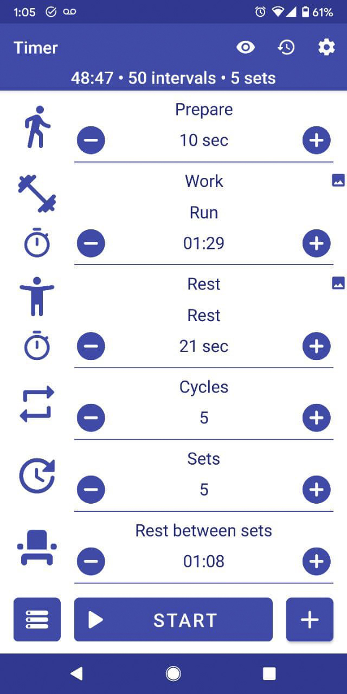

# Habits

A list of my current habits and routines

## Food

Currently I'm eating every day the same food as follows:

_Breakfast_:

- Oatmeal with Coconut Milk

_Second Breakfast_:

- 2 Eggs
- 1 Slice of bacon
- 1 Slice of toasted bread with butter
- 2 Mushrooms with onions

_Meal_:

- 1 Bell Pepper
- 3 Mushrooms
- 1 Zucchini
- 1/2 Avocado
- Few Pieces of Broccoli

---

## Recurrent Readings

- Deep Work

- Flow

- Anticancer

---

## Movies to Watch

### For Inspiration

- Edge of Tomorrow

---

## Physical Activity

### Running

This is the settings I'm currently using in my tabata timer to run

---

## Software

Set of tools to improve my productivity:

- Cold Turkey
- Cold Turkey Writer
- Beeminder
- Focusmate
- Rescuetime
